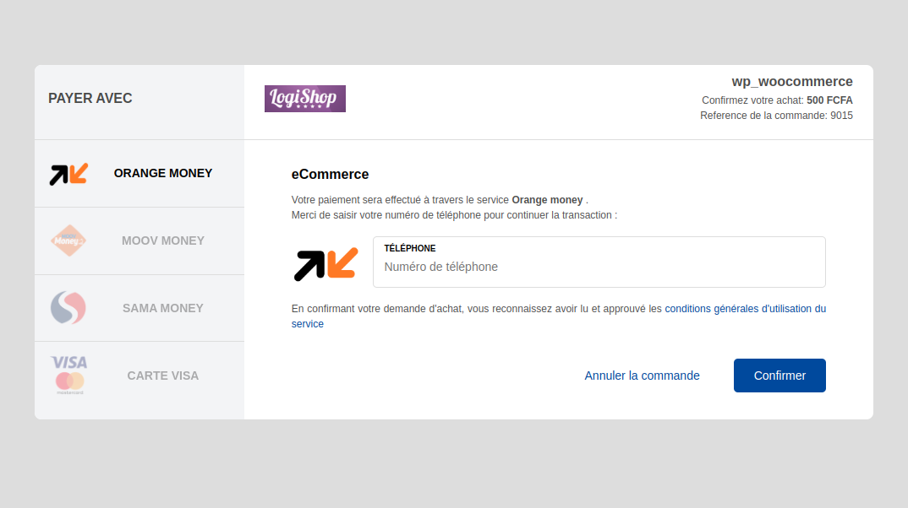

# Introduction

Vitepay est un service qui permet aux marchands d'augmenter leur chiffre d'affaire en 
offrant des moyens de paiements supplémentaires aux clients.

!!! 
Le service Vitepay n'est actuellement disponible qu'au **Mali**
!!!

Ceci se traduit concrètement par l'activation d'un bouton "Payer avec Vitepay" qui donne
le possibilité au client de valider son panier et payer avec :

- [x] Orange Money
- [x] Sama Money
- [ ] Malitel/Moov
- [ ] Visa/Mastercard
- [ ] Paypal

Notre objectif est de contiuer à fournir aux marchands des moyens simples et pratiques pour augmenter
leurs ventes.

## Site démo 

Pour voir comment fonctionne l'intégration sur votre site, vous pouvez [consulter le site démo](https://js.vitepay.com/v2/demo).

