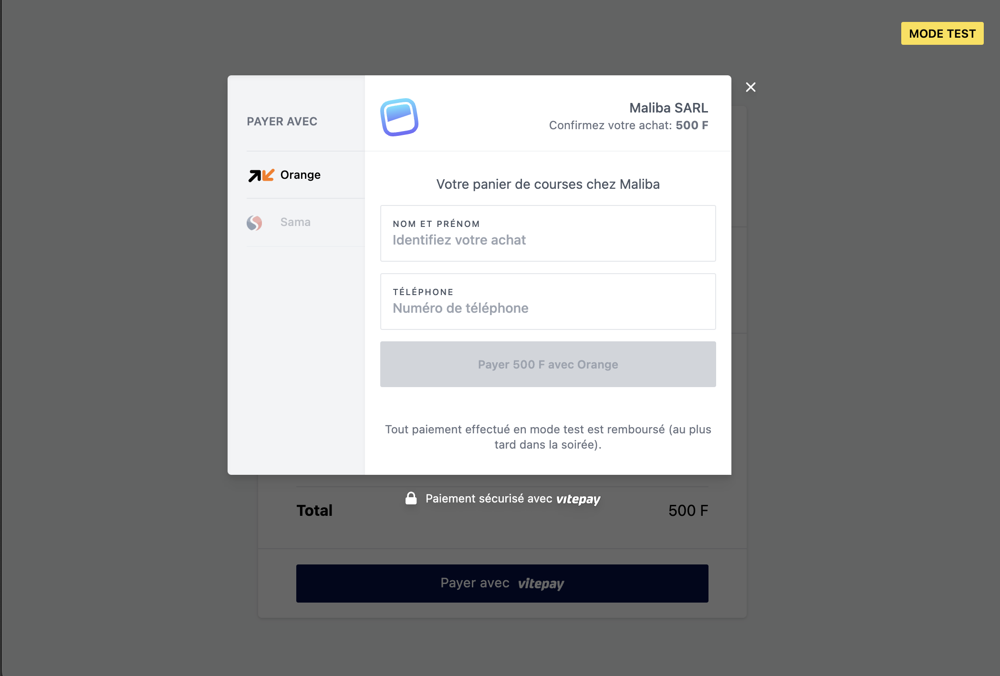

## Compte développeur

Lorsqu'un compte marchand est créé, vous recevez deux paires de clés (`test` et `live`):

**Une paire de clé pour l'environnement de test**
```
sk_test_KMyjxAdJdtVk4GmcX90992sL25abPc
pk_test_MCVVzJXVK1f65WkGT1210OObHzO0
```

**Une paire de clé pour l'environnement de production**
```
sk_live_Xc6UHD990XXh-WrBvAZClZ8lhpaI
pk_live_80Sc0Fp121213XTVD042xgbc
```

<hr />

La clé commençant par `sk_` représente une **clé secrète**. Cette clé est toujours utilisée dans des appels
serveur-à-serveur. Il est important de la conserver très loin des regards indiscrets.

La clé commençant par `pk_` représente une **clé publique**. Cette clé est toujours utilisée dans des appels
côté client et peut être intégré dans la partie frontale de votre site web. Cette clé est accessible en
affichant le code source de votre site web sans poser de problème de sécurité à votre compte.

Si vous jugez que votre clé secrète est corrompue vous pouvez accéder à votre espace marchand et générer de  nouvelles clés.


## Intégrer le bouton Vitepay

Au niveau de votre page de paiement ("Checkout"), le code ci-après est le mode d'intégration le plus simple et rapide.
La balise `<script></script>` sera remplacée par le bouton Vitepay en utilisant les attributs `data-*` pour personnaliser l'expérience client.

```html

<form action="/vitepay-callback" method="POST">
    <div>....</div>
    <script
                src="https://checkout.vitepay.com/v2.js"
                data-key="pk_test_MCVVzJXVK1f65WkGT03dYabHzO0"
                data-name="Maliba SARL"
                data-country="ML"
                data-order-id="order-234567890"
                data-method="orange_money"
                data-currency="XOF"
                data-currency-display="FCFA"
                data-description="Votre panier de courses chez Maliba"
                data-image="/img/maliba-logo.svg"
                data-amount="500">
    </script>
</form>
```



Name                    | Value { class="compact" }
---                     | ---
`data-key`              | Clé publique `test` ou `live`
`data-order-id`         | Identifiant de la commande côté Marchand
`data-name`             | Nom de votre site marchand
`data-country`          | Code pays de votre boutique (toujours à ML pour l'instant)
`data-method`           | Moyen de paiement activé par défaut
`data-currency`         | Devise (doit toujours être à XOF)
`data-currency-display` | La version affichée de la devise
`data-description`      | Un court libellé récapitulatif de l'achat
`data-image`            | Logo de votre site marchand
`data-amount`           | Montant du panier

### Formulaire et "capture"

Le bouton Vitepay doit toujours être intégré dans une balise `form`.

```html
<form action="/capture" method="POST">
</form>
```

Lorsque le paiement est effectué avec succès par le client, les étapes suivantes sont exécutées

1. Rajout des informations du paiement

Deux balises `input` sont insérées dans le formulaire avec l'identifiant et l'état de la transaction.

```html
<form action="/vitepay-callback" method="POST">
    <input type="hidden" name="payment_id" value="pi_test_9892891829181"/>
    <input type="hidden" name="payment_state" value="requires_capture|cancelled"/>
</form>
```

2. Submit du formulaire pour traitement côté serveur

La valeur `action` du formulaire doit pointer sur un script côté serveur. Au niveau de ce script,
vous devez utiliser votre clé `secrète` pour **capturer** le paiement lorsque ce dernier est à l'état `requires_capture`. 

Cette opération de capture est importante et permet de comptabiliser la commande dans votre balance. 

Le code ci-après est un **exemple** de code serveur qui exécute l'opération de capture et redirige l'utilisateur
vers une page de confirmation. 

```typescript

const endpoint = 'https://api.bantu.dev/payments/v1'

const secrets = {
    live: 'sk_live_Xc6UHbEZEZlh-WrBvAZClZ8lhpaI',
    test: 'sk_test_KMyjxAdezezzVk4Gmc5PbsL25abPc'
}

export async function post({request}: RequestEvent) {

    const data = await request.formData()
    const intentId = data.get('payment_id') as string

    const secret = intentId.indexOf('_test_') > -1 ? secrets.test : secrets.live

    const options = {
        method: 'POST',
        headers: {
            'Content-Type': 'application/json',
            'Authorization': `Bearer ${sk}`,
        }
    }
    
    const response = await fetch(`${endpoint}/payment-intents/${intentId}/capture`, options)
    
    if (response.status === 200) {
        return {
            headers: { Location: '/checkout/confirmation' },
            status: 302,
        }
    } else {
        const data = await response.json()
        return {
            body: { 
              error: data['message']
            },
            status: 500,
        }
    }
}
```


## Intégration WooCommerce

> En cours de construction

## Intégration Prestashop


> En cours de construction