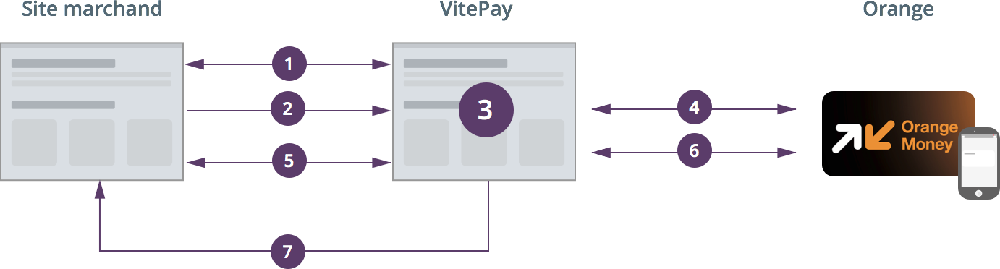

## Compte développeur

Lorsqu'un compte marchand est créé, vous recevez une paire de clés d'API (`api_key` et `api_secret`):

```
api_key: KMyjxAdJdtVk4GmcX90992sL25abPc
api_secret: MCVVzJXVK1f65WkGT1210OObHzO0
```

<hr />

Les clés d'API sont des identifiants numériques utilisés pour interagir avec les services de Vitepay. Elles sont essentielles pour intégrer les APIs de paiement Vitepay.

!!!
Assurez-vous d'abord de disposer d'un compte marchand Vitepay. Si ce n'est pas encore le cas, vous pouvez en [créer](https://checkout.vitepay.com/demo).
!!!

Connectez-vous à votre compte et accédez à l'option "Paramètres" puis "Kit d'intégration" pour recuperer les clés d'API.

Si vous jugez que votre clé secrète est corrompue vous pouvez accéder à votre espace marchand et générer de  nouvelles clés.

## Intégrer Vitepay

La présente documentation est destinée aux développeurs souhaitant intégrer le paiement VitePay sur un site marchand. 
Cette documentation n'est liée à aucune technologie. Le développeur est libre de faire l'intégration avec n'importe quel outil web.

:::img-container

:::


### 1. Récupération du REDIRECT_URL

Depuis le site marchand, vous devez récupérer une URL de redirection de la forme <br/>
`https://checkout1.vitepay.com/Ytr515` avant de rediriger le client vers VitePay pour effectetuer le paiement. Les étapes suivantes expliquent le mécanisme de récupération de cette URL de redirection.

Pour récupérer une URL de redirection, vous devez effectuer l'appel **POST** suivant : <br/>
`POST https://api.vitepay.com/v1/prod/payments`

!!!
Avant de passer en production vous devez avoir effectué au moins un payment concluant en mode sandbox (utiliser un numero joker).<br/>
Vous pouvez effectuer cet appel depuis un formulaire ou faire un appel serveur à serveur
!!!

`POST` https://api.vitepay.com/v1/prod/payment

#### Header of Request
```
content-type: "application/json" | "application/x-www-form-urlencoded"
```

#### Body of Request
```
{
    payment: {
        order_id: "xxw",
        language_code: "fr,
        currency_code: "XOF",
        country_code: "ML",
        description: "La description de l'achat ...",
        amount_100: 12500,
        return_url: "https://votre-site.ml/return_url",
        decline_url: "https://votre-site.ml/decline_url",
        cancel_url: "https://votre-site.ml/cancel_url",
        callback_url: "https://votre-site.ml/callback_url",
        buyer_ip_adress: "192.168.1.2", // IP du client qui effectue le paiement
        email: "client@email.ml"
    },
    redirect: 0 | 1,
    api_key: "KMyjxAdJdtVk4GmcX90992sL25abPc",
    hash: "KcX90992sM5MyjxAtVk4cX9dGmyjxAdM5MJd0992sL2abPc"
}
```
#### Description of the Body 
PARAMÈTRE                  | OBLIGATOIRE | TYPE    | DESCRIPTION { class="compact" }
---                        | ---         | ---     | ---
`payment[order_id]`        |     OUI     | string  | Le numéro de commande sur le site marchand. Les numéros de commande doivent être uniques sur le site marchand car VitePay n'accepte pas les doublons à ce niveau.
`payment[language_code]`   |     OUI     | string  | Langue dans laquelle la transaction est effectuée. Par défault: `fr` (français). Les codes supportés sont: fr, en 
`payment[currency_code]`   |     OUI     | string  | La devise internationale (ISO-4217) de la transaction en cours. Par défault: `XOF` ( Communauté Financière Africaine (BCEAO) )
`payment[country_code]`    |     OUI     | string  | Le code ISO du pays du site marchant. Valeur par défaut: `ML` (Mali)
`payment[description]`     |     OUI     | string  | Une description de l'achat effectué par le client (160 caractères au maximum).
`payment[amount_100]`      |     OUI     | integer | Le montant total de la transaction (x100). Ex: Si le montant du panier est de 12500 XOF, la valeur transmise à ce niveau doit être `payment[amount_100] = 1250000`
`payment[return_url]`      |     OUI     | string  | URL de votre site marchand vers laquelle VitePay redirigera le client si le paiement est effectué avec succès.
`payment[decline_url]`     |     OUI     | string  | URL de votre site marchand vers laquelle VitPay redirigera le client si le paiement est rejeté.
`payment[cancel_url]`      |     OUI     | string  | URL de votre site marchand vers laquelle VitePay redirigera le client si ce(tte) dernie(ère) annule le paiement
`payment[callback_url]`    |     OUI     | string  | Cette URL sera utilisé à l'étape 5 pour confirmer la transaction.
`payment[buyer_ip_adress]` |     NON     | string  | L'adresse IP du client qui effectue le paiement.
`payment[email]`           |     NON     | string  | Email du client qui effectue la transaction.
`redirect`                 |     OUI     | integer | Poisitionnez cette valeur à `1` lors d'un appel depuis un formulaire pour rediriger automatique le client vers la page de paiement.<br/>Transmettez la valeur `0` (valeur par défaut) lors d'un appel serveur-à-serveur. Vous devrez par la suite faire la redirection du client depuis votre site marchand vers l'url transmise par VitePay.
`api_key`                  |     OUI     | string  | Cette information vous est transmise par VitePay lors de l'enregistrement de votre site marchand. Contactez l'adminsitrateur du site pour lequel vous souhaitez faire l'intégration pour récupérer cette information.
`hash`                     |     OUI     | string  | Le hash est une valeur calculée avec la formule suivante : <br/>`SHA1(UPPERCASE("order_id;amount_100;currency_code;callback_url;api_secret"))`<br/>   1. Concaténez les différentes valeurs `order_id`, `amount_100`, `currency_code`, `callback_url` et `api-secret` en utilisant `;` (point-virgule) comme séparateur<br/>   2. Faites passer toute la chaîne en majuscules <br/>   3. Appliquer la fonction `SHA1(SHA1)`<br/><br/>`api_secret` : Cette information vous est transmise par VitePay lors de l'enregistrement de votre site marchand. Contactez l'adminsitrateur du site pour lequel vous souhaitez faire l'intégration pour récupérer cette information. 


En cas d'erreur lors de cet appel, VitePay retournera des informations pour vous aider à modifier votre code.<br/>
Si tous les paramètres attendus sont présents et valides, vous recevez une URL de la forme `https://checkout1.vitepay.com/Ytr515` à utiliser à l'étape suivante.

!!!
Vous pouvez simuler un paiement en mode sandbox sans passer par orange money en utilisant les numéro suivants:<br/>
`77000001` pour confirmer le paiement.<br/>
`77000009` pour annuler le paiement.
!!!

### 2. Redirection vers VitePay

L'URL sécurisée retournée à l'étape précédente est utilisée pour rediriger l'utilisateur vers le site VitePay pour continuer la transaction et effectuer le paiement. Il s'agit d'une redirection HTTP classique.

### 3. Confirmation du paiement
Le client est donc redirigé sur le site VitePay pour :
- Séléctionner la méthode de paiement;
- Renseigner le numéro de téléphone à utiliser pour effectuer le paiement ;
- Confirmer avoir pris connaissance des condiditions générales d'utilisation ;
- Valider la demande de paiement.

### 4. Envoi de la demande de paiement sur le téléphone du client

VitePay fait appel au service du partenaire (méthode de paiement séléctionnée) pour transmettre la demande de paiement au numéro de téléphone fourni par le client.
Une menu USSD permet au client de continuer la transaction sur son téléphone et de confirmer ou annuler le paiement.

### 5. Confirmation de la transaction sur votre site marchand

Quelle que soit le choix effectué par le client, nous en informons le site marchand en faisant un appel : `POST` au `callback_url` (voir `payment[callback_url]` transmis lors de l'appel pour la récupération du REDIRECT_URL). 

Cet appel server-à-server contient les paramètres suivants : 

PARAMÈTRE              | Valeur                     | DESCRIPTION { class="compact" }
---                    | ---                        | ---
`authenticity`         | string                     | Cette information permet de sécuriser la communication serveur-à-serveur. En effet, vous devez recalculer cette chaîne au niveau de votre intégration et la comparer à celle que nous vous transmettons. Ne modifier votre panier que s'il y a une correspondance parfaite.<br/><br/>Littéralement, `authenticity` est la valeur **SHA1** de la concaténation du **numéro de comande, montant de de la transaction (x100), devise et signature** du site marchand.<br/>`authenticity = SHA1("order_id;amount_100;currency_code;api_secret")`<br/><br/>`order_id` doit être en masjucules lorsqu'il ne s'agit pas d'une valeur numérique <br/>`currency_code` doit être en lettre masucules <br/>`SHA1` Le résultat du hashage SHA1 doit est transformé en majuscules
`order_id`             | string                     | Numéro de la commande sur le site marchand transmis à VitePay à l'**Etape 1**
`success` ou `failure` | `success=1` ou `failure=1` | Statut du paiement effectué depuis le téléphone du client. 
`sandbox`              |  `1` ou `0`                | Pour détecter les paiements en mode sandbox


Vous devez donc intégrer au niveau du site marchand le code nécessaire pour traiter ce callback server-à-serveur et effectuer les opérations suivantes :

1. Recalculer la signature
2. Compagner la signature calculée à celle transmise par VitePay
3. Vérifier que le numéro de commande est valide et que la transaction est toujours ouverte
4. Mettre à jour le panier en fonction du statut transmis (success=1 ou failure=1)
5. Retourner une réponse JSON à VitePay pour confirmer ou infirmer le traitement de l'opération sur le site marchand :<br/>
Dans le cas d'une confirmation, la réponse attendue est :
```
{ status:"1" }
```
Dans le cas contraire , la réponse attendue est :
```
{ 
    status: "0",
    message: "Raison pour laquelle le traitement est rejeté." 
} 
```

### 6. Notification du client

Le client reçoit un message sur son téléphone pour confirmer la transaction et effectuer le mouvements de fonds dans le cas d'une transaction concluante ou alors un message d'annulation de la transaction

### 7. Redirection finale

Site la transaction est concluante, VitePay redirige le client vers le site du marchand à l'adresse `return_url`.<br/>
Site la transaction n'est pas concluante, VitePay redirige le client vers le site du marchand à l'adresse `decline_url`.
